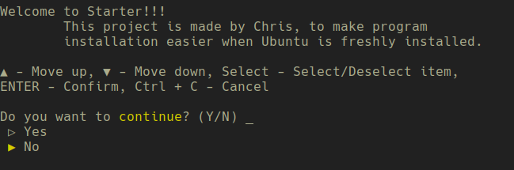
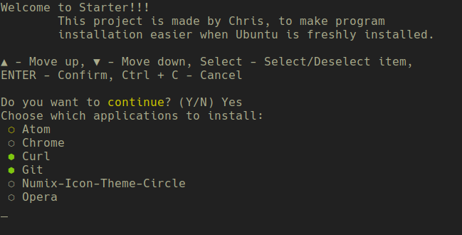

# Starter
> Install packages easier on Ubuntu.

### Screenshot   




### Usage
1. Clone the repository:  
`git clone https://github.com/evetness/Starter.git`  
2. Recommended to make a virtual environment in the project folder:  
`cd Starter`  
`python3 -m venv ./venv`
3. Activate the virtual environment:  
`. venv/bin/activate`
4. Install dependencies with the following:  
`pip install cutie`
5. Run the program:  
`python main.py`
6. Or simply run:  
`./starter.pex`

### Options
For the help guide run `python main.py -h`  
```
usage: main.py [-h] [-p PACKAGES] [-d DEFAULT]

Script that helps you to install easily your preferred packages. It uses apt,
snap, deb, repo. apt - apt packages, snap - snap packages, deb - deb file and
it needs the file link, repo - package name and repository name.

optional arguments:
  -h, --help            show this help message and exit
  -p PACKAGES, --packages PACKAGES
                        .csv file of the required packages. The file should
                        look like this (every package in a new line):
                        <manager>,<package_name>,<other>
  -d DEFAULT, --default DEFAULT
                        .csv file of the selected packages by default. Should
                        look like this (every package in a new line):
                        <package_name>

```  

### PEX  
How to create your own .pex file  
1. Install pex:  
`pip install pex`
2. Create .pex file:  
`pex . cutie -c main.py -o starter.pex -f dist --python-shebang='/usr/bin/env python3'`
3. Run:  
`./starter.pex`

## License
This project is licensed under the MIT License